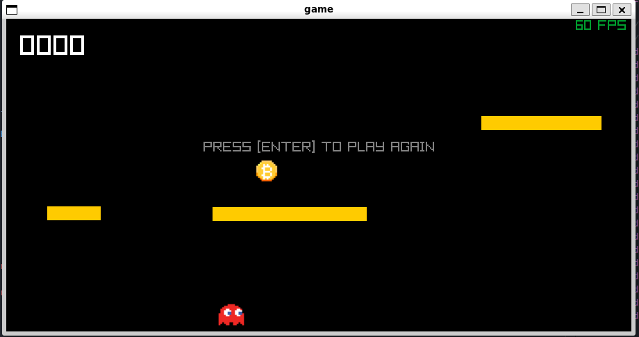

# 👻 Infinite Platform Jumper

**Infinite Platform Jumper** is an endless-platform jumping game where the player controls a character that must jump between moving platforms and collect coins. The longer you stay alive, the higher your score, but be careful not to fall!

 

## Features
- **Endless Platforms**: The game generates an infinite number of platforms, so you never run out of challenges.
- **Collect Coins**: Jump to collect coins and increase your score.
- **Smooth Movement**: Fluid character controls and smooth platforming mechanics.
- **Dynamic Obstacles**: Platforms move up and down, adding an extra layer of difficulty to the game.

## How to Play
- **Jump**: Use the spacebar or the "Enter" key to jump.
- **Collect Coins**: The goal is to jump and collect as many coins as possible.
- **Avoid Falling**: Don't fall off the platforms or you'll have to start over.
- **Score**: Your score increases with each coin you collect.

## Game Instructions
1. Press `Enter` to start the game.
2. Use arrow keys or the spacebar to control your character's jump.
3. The game ends when you fall off the screen. Press `Enter` again to play.
